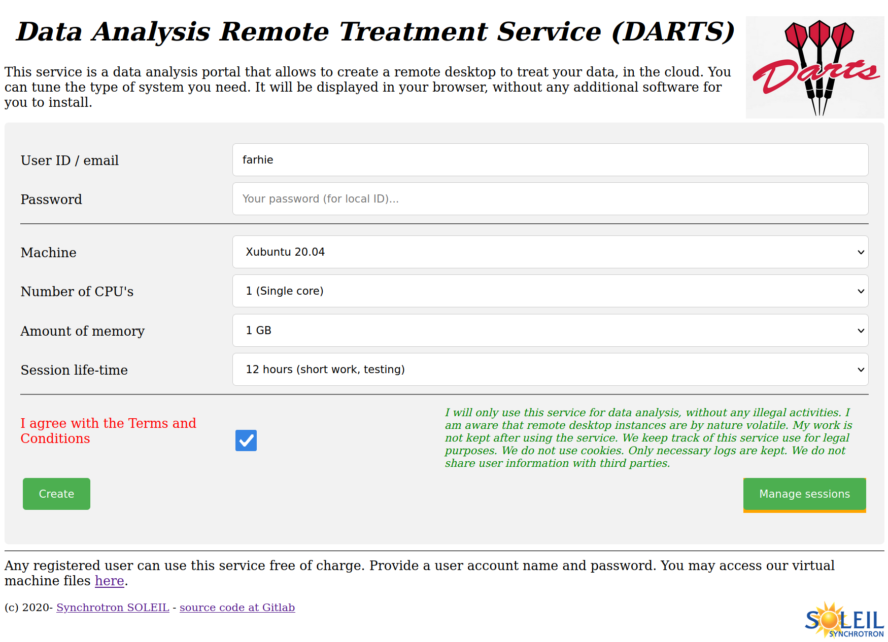
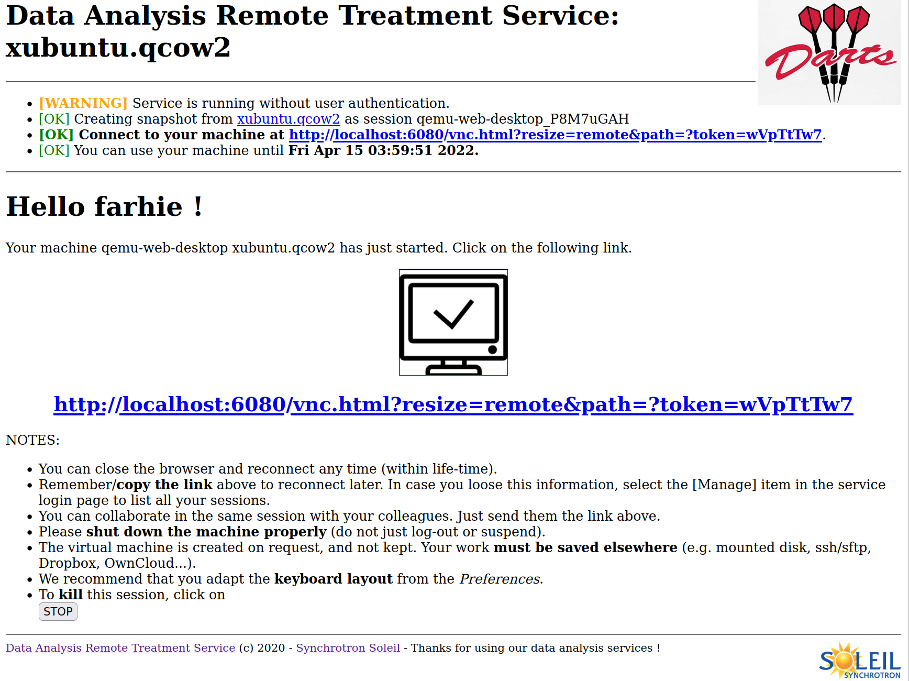
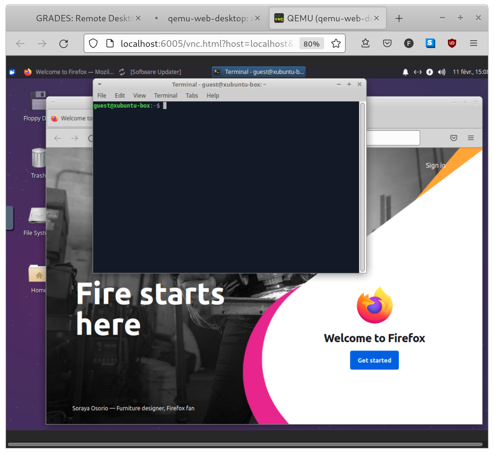
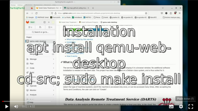
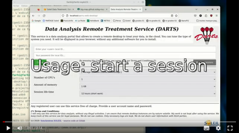

# qemu-web-desktop
<br>

<br>

Data Analysis Remote Treatment Service (DARTS) is a remote desktop service that launches virtual machines in the cloud, and displays them in your browser. These machines can be used for e.g. scientific data treatment.

[](https://doi.org/10.21105/joss.05562)
[](https://doi.org/10.5281/zenodo.7811689)

##### Table of Contents
- [What is provided by this service](#what-is-provided-by-this-service)
- [Installation](#installation)
- [Configuration](#customize-to-your-needs)
- [Managing virtual machines](#managing-virtual-machines)
- [Usage](#usage-as-a-web-service)
- [Installation with GPU](#installation-gpu-pass-through)
- [How it works](#how-it-works)

## What is provided by this service

The service allows authorized users to launch a remote virtual machine, and display it in a browser window. No additional software installation is needed on the client side. This project has been developed on a Debian-class system, and is thus suited for it.

Once installed (see below), connect to:
- http://localhost/qemu-web-desktop

Basically a user can enter some login/password or email, then specify what resources are needed (cpu, memory). It is also possible to select the type of machine (system), and if the machine is accessed only once, or can be accessed many times. After accepting the Terms and Conditions, the user can click on "Create".

<br>

<br>

The user credentials can be tested against IMAP, SMTP, and LDAP. In this case, a user ID (login name) and password are required. Authentication can also be achieved using an email sent with connection information.

When authentication is successful, a virtual machine is launched and can be displayed in the browser window. 

<br>

<br>

Just click the link, and you will access the virtual machine remote desktop. Use full screen, adapt screen resolution and keyboard layout, and you'll be good to go !

<br>

<br>

Features
--------
- Supports all common virtual machine formats (VDI, VMDK, VHD, VHDX, QCOW2, RAW), as well as ISO live images.
- Supports authentication using SMTP, IMAP, LDAP and email. See "customize" section below.
- Checks the server load to avoid DoS. See "customize" section below.
- The browser can be closed and re-connected later while the session is still running. The connection information can also be shared to allow multiple users to collaborate. It is important to remember the session URL. :warning: Beware: all users will have mouse/keyboard control, so that friendly collaboration rules must be set in place.
- No need to install anything on the client side.
- The rendering of the web service is responsive design. It adapts to the browser window size.
- Can monitor running sessions.
- Can mount host volumes.
- Automatically clean-up sessions that have passed their life-time.
- Can optionally assign physical GPU to sessions (see below).
- Can optionally insert and execute scripts in the virtual machine boot process.
- Can optionally distribute the sessions work-load over a farm of servers.


--------------------------------------------------------------------------------

## Installation

### The short story

First identify a computer with some CPU, memory. Install a Debian-class system (e.g. Ubuntu/Debian). Then install the required package with `sudo apt install qemu-web-desktop`, edit the `/etc/qemu-web-desktop/machines.conf` file and un-comment one of the entries (e.g. the Slax one), type `sudo qwdctl download`, then open the URL http://localhost/qemu-web-desktop/, enter a fake user ID (the authentication is inactivated at start), and click on Create. A VM should start.

[](https://drive.google.com/file/d/11_t28Z3FyjXDqtCmHf2XMezbjKC89ch8/view?usp=drive_link "DARTS Installation and configuration")
[](https://drive.google.com/file/d/1RKQSW5vSIWFbyKSe5D0DnqulWMzi2_yE/view?usp=drive_link "DARTS Usage")

### Installation in an ideal world (automatic, Debian/Ubuntu)

This service has been packaged for Debian. Get the [qemu-web-desktop.deb](https://packages.debian.org/sid/qemu-web-desktop) or type (from Debian 12):
```
sudo apt install qemu-web-desktop
```

Otherwise, install required packages. On a Debian-class system:
```bash
sudo apt install apache2 libapache2-mod-perl2 libapache2-mpm-itk
sudo apt install novnc websockify confget
sudo apt install qemu-kvm bridge-utils qemu iptables dnsmasq libguestfs-tools
sudo apt install libcgi-pm-perl liblist-moreutils-perl libsys-cpu-perl libsys-cpuload-perl libsys-meminfo-perl libnet-dns-perl libproc-background-perl  libproc-processtable-perl libemail-valid-perl libnet-smtps-perl libmail-imapclient-perl libnet-ldap-perl libemail-valid-perl libjson-perl libwww-perl libtext-qrcode-perl
```

:warning: if you just cloned the repository, make sure you collect the src/html/desktop/machines directory with [LFS](https://git-lfs.github.com/). Install it with `sudo apt install git-lfs` then, from the repo, `git-lfs install; git lfs pull`.

Then simply go in the `src` directory and type:
```bash
cd src
sudo make install
```

On a Debian class system, this should be enough.
In case the `make` command fails, you may proceed with a manual installation, as follows.

### Installation step by step (manual, other Linux)

Make sure permissions are set:
```bash
sudo adduser --system --home /var/lib/qemu-web-desktop --force-badname _qemu-web-desktop
sudo chmod 755 /etc/qemu-ifup
```
- copy the `html/machines` and `html/snapshots` directories into `/var/lib/qemu-web-desktop`.
- copy the html directory (except `machines` and `snapshots`) content into e.g. `/usr/share/qemu-web-desktop/html`. You should now have a 'desktop' item there.
- copy the cgi-bin directory content into e.g. `/usr/lib/cgi-bin` (Apache2 / Debian).
- copy the `apache.conf` file as e.g. `/etc/apache2/conf-available/qemu-web-desktop.conf`.
- uncomment or add available VM's in `/etc/qemu-web-desktop/machines.conf`.

and finally:
```bash
sudo chown -R _qemu-web-desktop /usr/share/qemu-web-desktop/html/
sudo find /usr/share/qemu-web-desktop/html/ -type f -exec chmod a+r {} +
sudo find /usr/share/qemu-web-desktop/html/ -type d -exec chmod a+rx {} +
sudo chmod 755 /usr/lib/cgi-bin/qemu-web-desktop.pl
sudo a2enconf qemu-web-desktop
sudo a2enmod cgi
sudo a2enmod include
sudo service apache2 restart
sudo qwdctl download
```

The installation steps for GPU pass-through are described at the end of this documentation.

To un-install, just do a `cd src; sudo make uninstall`.

--------------------------------------------------------------------------------

## Customize to your needs

The service configuration resides in a set of files, as follows:

| File | Description |
|------------------|-------------|
| `/etc/qemu-web-desktop/config.pl` | Main service configuration file. The `config_script` allows further customization of VM's when they boot. |
| `/usr/share/qemu-web-desktop/html/desktop/index.html` | Form. Edit to change appearance, comment/un-comment optional features (GPU, scripts...) |
| `/etc/qemu-web-desktop/machines.conf` | List the available VM's to propose in the service. Run `sudo qwdctl download` after edits. |
| `/etc/qemu-web-desktop/config.pl`:`check_user_custom` | A function reference that is executed when the user clicks on _Create_ to e.g. perform further checks. |
| `/etc/qemu-web-desktop/config.pl`:`config_script` | Auto start scripts. This allows to configure the session _during_ its boot. An example can be `$config{config_script}=("https://gitlab.com/soleil-data-treatment/infra-config/-/raw/master/hosts/grades-vm/SOLEIL-DARTS-auto-login.sh")`. |


Edit the `/etc/qemu-web-desktop/config.pl` file:

- adapt location of files (esp. directories to `machines`,`snapshots`).
- adapt the default specification of virtual machines (cpu, mem).
- adapt the restrictions for using the service (number of connections, load limit).
- adapt the user credential tests you wish to use. They are all tested one after the other, until one works.

If the VMs you wish to run use a different architecture than the host
running the service, you also need to adapt the `$config{qemu_exec}`
variable to the architecture you wish to emulate. Note that you also
need to install the appropriate variant of qemu-system-XXX.

Most options below can be changed in the configuration script, or overridden with command line argument `--name=value`.

Un-comment at will sections in `/usr/share/qemu-web-desktop/html/desktop/index.html` to activate support for GPU, user scripts, and one-shot sessions (which use multiple ports). 

Changes to the configuration are immediate, and there is no need to restart the
server nor the web service.

We list below some of the common options.

### Configuration: Location of files and directories

The main configuration file is `/etc/qemu-web-desktop/config.pl`.
Web pages are usually in `/usr/share/qemu-web-desktop/html/desktop`.
Virtual machines are usually in `/var/lib/qemu-web-desktop`.
List of available virtual machines for `qwdctl` in `/etc/qemu-web-desktop/machines.conf`.
These settings should be kept to their default for an Apache web server.

| Locations | Default | Description |
|------------------|---------|-------------|
| `dir_html` | /usr/share/qemu-web-desktop/html   | HTML server root. Contains the `index.html` form |
| `dir_service`  | /var/lib/qemu-web-desktop     | Location of virtual machines |
| `dir_machines` | /var/lib/qemu-web-desktop/machines | Full path to machines (ISO,VM) |
| `dir_snapshots` | /var/lib/qemu-web-desktop/snapshots | Where snapshots are stored |
| `dir_cfg` | /tmp | Temporary files (JSON for sessions) |
| `dir_novnc` | /usr/share/novnc | Location of noVNC directory, must contain `vnc.html` |
| `dir_websockify` | websockify | Location of Websockify executable |
| `dir_mounts` | (/mnt,/media) | Volumes from host to mount in guests. Use e.g. `mount -t 9p -o trans=virtio,access=client host_media /mnt/media` in guest. The last word of the mount path is used to build the 9p label `host_<last_word>`.|

### Configuration: Server settings

| Important options | Default | Description |
|------------------|---------|-------------|
| `snapshot_lifetime` | 86400   | Maximum time in seconds above which sessions are stopped |
| `service_max_load`  | 0.8     | Maximal load of the machine, in 0-1 where 1 means all CPU's are used |
| `service_max_instance_nb` | 10 | Maximum number of simultaneous sessions |
| `service_port` | 6080 | The port to which the display will be broadcast. This is shown in the client URL. When `service_port_multiple` is set, the port is chosen randomly in `[service_port:service_port+service_max_instance_nb]` |
| `service_port_vnc` | 5901 | The base internal VNC port to use |
| `service_port_multiple` | 0 | When true, use one websockify port per instance (e.g. :6080+rand). When false, a single port is used for all sessions with random tokens, except for one-shot sessions. |
| `service_proxy` | "" | A proxy URL to pass through when getting external scripts, e.g.  "http://xxx.yy.z:port/". This is used for the auto-start script option (see [Usage](#usage-as-a-web-service)). |
| `certificate_crt` | /etc/apache2/certificate/apache-certificate.crt | A certificate CERT bundle in order to use HTTPS. The KEY must also be available. The web server should use the same certificates. |
| `certificate_key` | /etc/apache2/certificate/apache.key | A certificate KEY in order to use HTTPS. The CERT must also be available. The web server should use the same certificates. |
| `fallback_servers` | "" | A comma-separated list of servers, e.g. `http://server1,server2,195.221.4.1`. URL, server names and IP are allowed. When the current server is overloaded (cpu,mem,GPU), the request is sent to the other servers. |
| `config_script` | ("") | An array of strings specifying scripts to execute at boot, as root (see below). |

#### Configuration: Server: Using `config_script`

Each string can be given as:

- a URL "http://some/url"
- a path "/some/local/path/to/script"
- a string starting with `exec:` followed by shell commands separated by EOL or `;`
- a string starting with `virt-customize:` followed by one-line commands separated by EOL `\n`. (see: https://libguestfs.org/virt-customize.1.html). 

The symbols `@USER@` `@SESSION_NAME@` and `@VM@` are replaced by the user name, the session ID, and the virtual machine name. 

In addition, when the above script description is preceded by `if(EXPR):`, the given expression is evaluated (with Perl) and the script is only executed when result is True. The `EXPR` condition may use the `@...@` symbols above.

This way, it is possible to specify scripts that apply to given virtual machines with e.g.:

- `if("@VM@" =~ /debian/i): http://some/url` (only for _debian_ VM's, case insensitive).
- `if("@VM@" =~ /debian/): exec: touch /tmp/my_script_is_executed` (only for _debian_ VM's, case sensitive).
- `if("@VM@" =~ /unstable/i): https://gitlab.com/soleil-data-treatment/soleil-software-projects/trunk-in-my-car/-/raw/main/SOLEIL-DARTS-auto-login.sh` for our auto-login process at Synchrotron SOLEIL.
- `if("@USER@" =~ /farhie/): http://some/url` (only for a given user).

Scripts can be specified in `/etc/qemu-web-desktop/config.pl: config{config_script}`, as well as in the `index.html` form by un-commented the corresponding section. A text box then allows to enter the script description, but this setting is not recommended as it potentially provides a root access to all VM's and all users.


#### Configuration: Server: Security aspects

| :warning: Note about the used ports |
|---|
| <b>Highest security:</b> The default setting is `service_port_multiple=0` which indicates that a single port is used for all sessions. The 'one-shot' and the auto-start user script options in the `/usr/share/qemu-web-desktop/html/desktop/index.html` file should be left commented (inactivated). The HTTPS certificates should as well be set (see above). The user scripts should also better be inactivated in the form, and the VM's should not allow administrator privileges (e.g. `sudo`). These are the recommended settings for a secured network. |
| <b>Medium security:</b> Optionally un-comment the 'one-shot' option in the `/usr/share/qemu-web-desktop/html/desktop/index.html` file. One specific port will be used for these sessions, and be closed as soon as the session browser tab is closed. Other sessions will use a single shared port when `service_port_multiple=0`. |
| <b>Low security:</b> When `service_port_multiple=1`, each session has its own communication port. You can un-comment the 'one-shot' and the auto-start user script sections in the `/usr/share/qemu-web-desktop/html/desktop/index.html` file.  The ports `service_port` up to `service_port+service_max_instance_nb` must be allowed on the network. |

In a high security level, it is highly recommended to configure a firewall in order to restrict e.g. the SSH connections from the running sessions to other local infrastructure servers. For instance, one would use:
```
# allow SSH access to the QEMU host [10.0.2.2] (insert at top -I)
/sbin/iptables -I OUTPUT -d 10.0.2.2        -p tcp --dport ssh -j ACCEPT

# restrict SSH access to a local domain (append at end -A)
/sbin/iptables -A OUTPUT -d 192.168.0.0/16  -p tcp --dport ssh -j REJECT
/sbin/iptables -A OUTPUT -d 10.0.0.0/8      -p tcp --dport ssh -j REJECT
```

We also encourage to hide the service port, as detailed below.

### Configuration: User credential settings

It is possible to activate more than one authentication mechanism, which are tested until one works. The details of the SMTP, IMAP and LDAP server settings should be set in the `/etc/qemu-web-desktop/config.pl` script.

| User authentication | Default | Description |
|------------------|---------|-------------|
| `check_user_with_email` | 0 | When set and user ID is an email, a message with the connection information is sent as authentication |
| `check_user_with_imap` | 0 | When set, the user ID/password is checked against specified IMAP server |
| `check_user_with_smtp` | 0 | When set, the user ID/password is checked against specified SMTP server |
| `check_user_with_ldap` | 0 | When set, the user ID/password is checked against specified LDAP server |
| `check_user_custom`    | "" | May point to a function reference to allow any identification mechanism (see below) |

##### Configuration: Custom authentication mechanism

It is possible to define custom authentication mechanisms via a user function that should get `(user, pw, authenticated, session_ref)` as arguments (see below) and return a string starting by "SUCCESS" or "FAILED". 
The default return value should be the previous authenticator results. 
Any "SUCCESS" in the returned string fully qualifies the authentication.

In practice, define such a function in `/etc/qemu-web-desktop/config.pl` as for instance:
```perl
sub check_user_func {
  my $user          = shift;
  my $pw            = shift;
  my $authenticated = shift; # previous authenticator results
  my $session_ref   = shift;  
  
  if (not $session_ref) { return $authenticated; }
  my %session     = %{ $session_ref };
  my $res           = "";
  
  # choose state depending on $user and $pw, as well as previous $authenticated
  res = "SUCCESS: [Custom] $user authenticated.";

  # or when authentication fails
  res = "FAILED: [Custom] $user failed authentication.";
  
  # or if we skip tests, we may return the previous authentication message
  res = $authenticated;

  return "$res";
}

$config{check_user_custom} = \&check_user_func;
```

or directly as an anonymous function
```perl
 $config{check_user_custom} = sub { ... };
```

Such a function could be used as an independent authenticator when other authenticators have failed.

But the custom function could also be used as a further check, validating a previously successful authentication, such as in:
```perl
sub check_user_func {
  my $user          = shift;
  my $pw            = shift;
  my $authenticated = shift; # previous authenticator results
  my $session_ref   = shift;
  
  if (not $session_ref) { return $authenticated; }
  my %session     = %{ $session_ref };
  my $res = "";
  
  # any previous authenticator was successful
  if (index($authenticated, "SUCCESS") >= 0) {
    # make further checks on user credentials 
    if((length($pw)<8) ||
      ($pw !~ /[A-Z]/)  ||
      ($pw !~ /[0-9]/)  ||
      ($pw !~ /[a-z]/)  ||
      ($pw !~ /[@#*=&%><~_\$\-\+.,;:!\?]/)){
      $res .= "FAILED: $user, your password is not strong. It must be at least 8 characters long, contain lower, upper letters, digits and special characters (within @#*=&%><~_$-+.,;:!?). Please update your password and try again.";
    }
  }
  # must check for a valid email
  if (not Email::Valid->address($session{user_email})) {
    $res .= "FAILED: $user, your email address $session{user_email} is not valid. You need an account with a valid email. Please update your account information.";
  }
  
  # default: return failure or previous authenticator
  if ($res) { return $res; }
  return $authenticated;
}
$config{check_user_custom} = \&check_user_func;
```
In this example, additional requirements are set, checking password strength and email availability.

##### IMAP/SSL encryption level

:warning: The SSL encryption level of the IMAP server (for user credentials) should match that of the server running the remote desktop service. 
The current Debian rules are to use SSL v1.2 or v1.3. In case the user IMAP authentication brings errors such as:
```
IMAP error "Unable to connect to <server>: SSL connect attempt failed error:1425F102:SSL routines:ssl_choose_client_version:unsupported protocol."
```
which appears in the Apache2 error log (`/var/log/apache2/error.log`), then you may [downgrade the SSL encryption](https://stackoverflow.com/questions/53058362/openssl-v1-1-1-ssl-choose-client-version-unsupported-protocol) requirement in the file `/etc/ssl/openssl.cnf` in a section such as:
```
[system_default_sect]
MinProtocol = TLSv1
CipherString = DEFAULT@SECLEVEL=1
```

### Configuration: Hiding the service port

The default URL to connect to the sessions indicates a port such as `:6080` as defined in the `/etc/qemu-web-desktop/config.pl` configuration file. 

It may be necessary to show a URL that only goes through usual HTTP/HTTPS ports.

First define a new Apache configuration rule which redirects `/darts` to `:6080`.

``` xml
# /etc/apache2/conf-available/hide-darts-port.conf
<Location /darts>
    ProxyPass http://localhost:6080
    ProxyPassReverse http://localhost:6080
</Location>
```
where the port must be adapted to that of `$config{service_port}` (here 6080).

Then activate it:

``` bash
sudo a2enmod proxy
sudo a2enmod proxy_http
sudo a2enmod proxy_http2
sudo a2enconf hide-darts-port.conf
sudo systemctl restart apache2
```

and the CGI script should be adapted so that the lines (around 820):
``` perl
    $session{url} = "$config{http}://$session{server_name}:$session{port}/vnc.html?resize=scale&autoconnect=true&path=?token=$session{token_vnc}&port=$session{port}";
```

should be changed to:
``` perl
    $session{url} = "$config{http}://$session{server_name}/darts/vnc.html?resize=scale&autoconnect=true&path=?token=$session{token_vnc}&port=$session{port}";
```

Then the URL will be pure HTTP/HTTPS, without the need to open other ports for the outside world. This can only be setup in the case of `$config{service_port_multiple}=0`.

### Configuration: Distributing the sessions work-load (load-levelling, scale-up)

It is possible to distribute the sessions over a set of servers. Each server has 
its own settings (load, GPU, ...). When the current server is overloaded 
(number of sessions,  cpu, mem, GPU), the request is sent to other servers in 
the list, until one can provide the service. A session must still fit on a single server (it can not be split into parts on different servers).

The only requirements are:

- install DARTS/qemu-web-desktop on all servers.
- configure each server with their own settings.
- install the same virtual machines on all servers (must have same name).
- set `fallback_servers` to a comma-separated list of servers, e.g. `http://server1,server2,195.221.4.1`. All of URL, server names and IP are allowed. The URL should be preferred as it indicates the protocol to use (http or https).
- make sure fallback servers are reachable. However when a server is down, it is ignored, so that the computing infrastructure can cope with failures.

The list of fallback servers may be the same for all servers in the farm, so 
that the workload is fully shared and distributed equally, whatever be the used entry point. You may favour one entry point, and distribute the load to other servers. But you may as well define specific fallback lists on various servers, to allow 
different entry points and workload distributions. For instance you may group 
servers providing GPU's and similar resources. You may as well redirect to shared 
servers when local private servers are filled, but not the other 
way round, to secure some resources. Only the `fallback_servers` list has to be 
specified to scale-up your infrastructure.

There is no need to install any other complex load-leveller system. The DARTS
system is a decentralized cluster. Any of its elements is an entry point to the
service, and distributes the load automatically when needed.
Following the above procedure provides a very fast way to scale-up a compute 
infrastructure. Just install a new computer with DARTS/qemu-web-desktop, and add
its name to the other nodes. It will immediately be callable.

--------------------------------------------------------------------------------

## Managing Virtual machines

### Creating virtual machines

It is possible to create a VM from an ISO, just like you would boot physically. An empty disk is first created (here with size 10GB).
```bash
qemu-img create -f qcow2 machine1.qcow2 10G
```
Then you should boot from an ISO file (here indicated as `file.iso`)
```bash
qemu-system-x86_64  -m 4096 -smp 4 -hda machine1.qcow2 -name MySuperbVM -boot d -cdrom file.iso  -device ich9-ahci,id=ahci -enable-kvm -cpu host -vga qxl -netdev user,id=mynet0 -device virtio-net,netdev=mynet0 -device virtio-balloon
```
and install the system on the prepared disk. If you can not start qemu/kvm with a message `Could not access KVM kernel module: Permission denied; qemu-system-x86_64: failed to initialize kvm: Permission denied`, execute the command `sudo /sbin/adduser $USER kvm`, then logout/login.

You may also convert an existing VDI/VMDK file (VirtualBox and VMWare formats - here `file.vmdk`) into QCOW2 for QEMU (here machine1.qcow2`) with command:
```bash
qemu-img convert -f vmdk -O qcow2 file.vmdk machine1.qcow2
```

In case you have an OVA file for VirtualBox, extract it, and convert it afterwards to a QCOW2 file.
```
tar -xvf file.ova
qemu-img convert -f vmdk -O qcow2 file.vmdk machine1.qcow2
```

Last, you may dump an existing physical disk (with a functional system - here from device `dev/sda`) into a QCOW2 format:
```bash
qemu-img convert -o qcow2 /dev/sda machine1.qcow2
```

The QCOW2 format allows to resize disks, for instance with:
```bash
qemu-img resize machine1.qcow2 +50G
```

If a VM file gets too large, you can (re)compress it with command:
```
qemu-img convert -O qcow2 -c image.qcow2 image_compressed.qcow2
```

### Adding virtual machines to the service

The easiest is to make use of the `qwdctl` tool (see below). Other options are activated by un-commenting sections in the file `/usr/share/qemu-web-desktop/html/desktop/index.html`.

Common virtual machine image file formats are supported (QCOW2, VDI, VMDK, RAW, VHD/VHDX, QED), as well as ISO live images.

#### Automatic configuration of virtual machines via `qwdctl`

Each entry in the configuration file `/etc/qemu-web-desktop/machines.conf` spans on 2 or 3 lines:

-  [name.ext]
-  url=[URL to ISO, QCOW2, VDI, VMDK, RAW, VHD/VHDX virtual machine disk] (optional if the file is already present)
-  description=[description to be shown in the login page] 

Images listed in the configuration file without a `url=` parameter are expected to be downloaded by hand and installed into `/var/lib/qemu-web-desktop/machines` by the local administrator. in this case, just specify the [name.ext] and [description]. 

Images with a `[url]` line are downloaded (requires a configured network connection).

Then actually launch
```
sudo -E qwdctl download
```
or, to only update existing machines, use:
```
sudo -E qwdctl refresh
```
To list active sessions, use:
```
qwdctl status
```

#### Manual configuration of virtual machines

You may also do this by hand. Place any ISO, QCOW2, VDI, VMDK, RAW, VHD/VHDX, QED virtual machine file in e.g.
`/var/lib/qemu-web-desktop/machines`.

```bash
ls /var/lib/qemu-web-desktop/machines

dsl.iso    slax.iso    machine1.qcow2 ...
```
Then create/edit the `/usr/share/qemu-web-desktop/html/machines.html` (link from `/var/lib/qemu-web-desktop/machines.html`) web page and add entries to reflect the VM files in `html/machines`:
```html
  <option value="slax.iso">Slax (Debian)</option>
  <option value="dsl.iso">Damn Small Linux</option>
  ...
  <option value="machine1.qcow2">My superb VM</option>
  ...
```

You can also comment/uncomment sections (e.g. GPU, user script, one-shot) at will in the main web page `/usr/share/qemu-web-desktop/html/desktop/index.html`. Defaults will then be used.

:+1: This project provides minimal ISO's for testing (in `html/desktop/machines`):

- [Slax](https://www.slax.org/) a modern, yet very compact Debian system (265 MB)
- [DSL](http://www.damnsmalllinux.org/) a very compact, old-style Linux (50 MB)

We also recommend:

- https://puppylinux-woof-ce.github.io/index.html
- https://www.bodhilinux.com/

There exist some virtual machine repositories, for instance:

- https://marketplace.opennebula.systems/appliance
- https://www.osboxes.org

### Starting, sharing, stopping, re-connecting

The DARTS/qemu-web-desktop service allows to connect and re-connect to active sessions (except for one-shot sessions). It is also possible to share the connection link to an active session, so that multiple users can see and interact on the same environment. Last, sessions can be ended either from the sessions themselves (find the 'Shutdown' item), or aborted with the 'Stop' button shown in the session information page.

All of these actions are possible when selecting the 'Manage sessions' button on the right of the service page, with proper credentials. Only your sessions will be listed.

--------------------------------------------------------------------------------

## Usage: as a web service

First make sure the service has been installed in the `html/desktop` root level of the host, and the `cgi-bin/qemu-web-desktop.pl` e.g. in the `/usr/lib/cgi-bin`.

Open a browser and go to:

- http://localhost/qemu-web-desktop/

Customize your machine with the usual settings:

- the user credentials. The protocol used for checking depends on the `/etc/qemu-web-desktop/config.pl` settings (default is 'no check').
- the system (virtual machine) to boot.
- the number of cores (#CPU).
- the amount of memory.
- the life-time.

Optionally (when un-commenting sections in the web form `/usr/share/qemu-web-desktop/html/desktop/index.html`)

- a GPU request (the system must have been configured as explained below).
- the auto-start script to execute at boot. This script may contain any set of commands (installations via `apt`, `pip` or `conda`, configuration, start-up of a service or application, ...). The symbols `@USER@` `@PW@` `@SESSION_NAME@` and `@VM@` are replaced by the user name/pw, the session ID, and the virtual machine name. The script is executed with administrator privileges in the guest virtual machine. In case the server is protected by a proxy, the `service_proxy` must be set in the `/etc/qemu-web-desktop/config.pl` file to access external resources. This option is not recommended for high security systems. The script may be:
    * a path to a script on the server
    * a URL to a distant file (URL such as on <a href="github.com">github.com</a> or <a href="gitlab.com">gitlab.com</a> - make sure to provide a raw content). We provide as an example the script https://gitlab.com/soleil-data-treatment/soleil-software-projects/trunk-in-my-car/-/raw/main/start-script.sh
    * a string starting with `exec:` or `bash:` and followed by shell commands separated by ';' or EOL. An example would be `exec: touch /tmp/hello`.
- the one-shot button, which creates virtual machines allowing only a single connection.

Then press the **Create** button. After about 10 seconds, information is displayed. Follow instructions, click the given link or scan the QR code to connect the display. You can of course access the service remotely if the server is on a network.

Connect within a browser to the displayed IP, such as:

- http://localhost:6080/vnc.html?resize=remote&path=?token=jNIjYTUn

Once done with the session, make sure you shut-down the remote desktop session. Do not just close the browser, suspend or logout. This is to free the resources for others once you do not need the session anymore.

You can close the browser any time, and reconnect later: the session remains active, any calculation will proceed. To reconnect you may click again on the link. If you have lost this link, first click on the **Manage sessions** button (or select the same item in the machine list), then find the relevant session in the table, and select the CONNECT item. You may as well stop the session prematurely with the STOP button.

Last, it is possible to send the session link to your colleagues (or the QR code), so that you all see the same desktop and work together. 
You should however notice that rules must be adopted to share your multiple keyboards and mice.

Once the maximum life-time is over, the session is automatically stopped and cleaned-up. There is no way to recover a cleared session.

## Usage: local (for testing)

It is possible to test that all works by launching a Slax distribution.

```bash
cd qemu-web-desktop/src
make test
```

or manually

```bash
cd qemu-web-desktop/src
perl cgi-bin/qemu-web-desktop.pl --dir_service=html/desktop \
  --dir_html=html --dir_snapshots=/tmp --qemu_video=std \
  --dir_machines=html/desktop/machines/ --oneshot=1
```
which uses the configuration file at `/etc/qemu-web-desktop/config.pl` or the default `config.pl` from the repo (must be there).

A text is displayed (HTML format) in the terminal, which indicates a URL.

Connect with a web browser to the displayed URL, such as:
- http://localhost:6005/vnc.html?resize=scale&autoconnect=true&host=localhost&port=6005

The `qemu-web-desktop.pl` script can be used as a command with additional arguments. The
full list of supported options is obtained with:
```bash
qemu-web-desktop.pl --help
```

You can force a session to stop with:
```bash
qemu-web-desktop.pl --session_stop=/path/to/json
```

And you can stop and clear all sessions with:
```bash
qemu-web-desktop.pl --session_purge=1
```

Last, you can monitor all running sessions, with:
```bash
qwdctl status
```

or
```bash
qemu-web-desktop.pl --service_monitor=1 > /tmp/mon.html
firefox /tmp/mon.html
```
which generates an HTML file and renders it in a browser.

:warning: For all the above commands, make sure you have to permissions to access the `dir_snapshots` and `dir_cfg` directories. You can specify these with:
```bash
qemu-web-desktop.pl  ... --dir_snapshots=/tmp --dir_cfg=/tmp
```

--------------------------------------------------------------------------------

## Installation: GPU pass-through

It is possible to use a physical GPU inside virtual machine sessions.

:warning: This GPU is exclusively attached to the virtual machine, and can not anymore be used on the server for display. This implies that you should have at least two distinct GPU's (of different model).

In the following, we assume we have a server with an AMD CPU, and NVIDIA GPU's, all running on a Debian system. The first step is to ensure that your server can detach a GPU from the host system. The feature which is used is called IOMMU/VFIO.
```
sudo dmesg | grep "AMD-Vi\|Intel VT-d"
[    1.059323] AMD-Vi: IOMMU performance counters supported
lscpu | grep -i "Virtualisation"
Virtualisation :                        AMD-V
egrep -q '^flags.*(svm|vmx)' /proc/cpuinfo && echo virtualization extensions available
virtualization extensions available
lspci -nnv | grep "VGA\|Audio\|Kernel driver in use: snd_hda_intel\|Kernel driver in use: nouveau\|Kernel driver in use: nvidia\|Kernel driver in use: nouveaufb\|Kernel driver in use: radeon"
4c:00.0 VGA compatible controller [0300]: NVIDIA Corporation GP108 [10de:1d01] (rev a1) (prog-if 00 [VGA controller])
    Kernel driver in use: nvidia
4c:00.1 Audio device [0403]: NVIDIA Corporation GP108 High Definition Audio Controller [10de:0fb8] (rev a1)
    Subsystem: ASUSTeK Computer Inc. GP108 High Definition Audio Controller [1043:8746]
    Kernel driver in use: snd_hda_intel
4d:00.0 VGA compatible controller [0300]: NVIDIA Corporation GP108 [10de:1d01] (rev a1) (prog-if 00 [VGA controller])
    Kernel driver in use: nvidia
4d:00.1 Audio device [0403]: NVIDIA Corporation GP108 High Definition Audio Controller [10de:0fb8] (rev a1)
    Subsystem: ASUSTeK Computer Inc. GP108 High Definition Audio Controller [1043:8621]
    Kernel driver in use: snd_hda_intel
```
which results in a list of available GPU. In the following, we assume we have two low-cost/power NVIDIA GT 1030 (384 cores, 2 GB memory) cards, on PCI addresses `4c:00` and `4d:00`. It is important to also take note of the hardware vendor:model code for the GPU, here `10de:1d01` and `10de:0fb8` for the video and audio parts.

In the following step, we detach these GT 1030 cards at boot. In the `/etc/default/grub` file activate IOMMU, and flag the vendor:model codes (here with video and sound parts - multiple cards are possible separated with commas):
```
GRUB_CMDLINE_LINUX_DEFAULT = "quiet amd_iommu=on iommu=pt vfio-pci.ids=10de:1d01,10de:0fb8"
```
For Intel CPU's, you would use option `intel_iommu=on`.
This GPU information should also be added as a `modprobe` option. Create for instance the file `/etc/modprobe.d/vfio.conf` with content:
```bash
# /etc/modprobe.d/vfio.conf
options vfio-pci ids=10de:1d01,10de:0fb8 disable_vga=1
```
and push necessary modules into the kernel by adding:
```
# /etc/initramfs-tools/modules
vfio
vfio_iommu_type1
vfio_pci
vfio_virqfd
vhost-netdev
```
into file `/etc/initramfs-tools/modules`.

Finally reconfigure the boot and linux kernel, and restart the server:
```bash
sudo update-initramfs -u
sudo update-grub
sudo reboot
```
After reboot, the command `lspci -nnk` will show the detached cards as used by the `vfio-pci` kernel driver.
```
4d:00.0 VGA compatible controller [0300]: NVIDIA Corporation GP108 [GeForce GT 1030] [10de:1d01] (rev a1) (prog-if 00 [VGA controller])
	Subsystem: ASUSTeK Computer Inc. GP108 [GeForce GT 1030] [1043:8621]
	Flags: fast devsel, IRQ 4, IOMMU group 61
	Memory at ad000000 (32-bit, non-prefetchable) [disabled] [size=16M]
	Memory at 70000000 (64-bit, prefetchable) [disabled] [size=256M]
	Memory at 80000000 (64-bit, prefetchable) [disabled] [size=32M]
	I/O ports at a000 [disabled] [size=128]
	Expansion ROM at ae000000 [disabled] [size=512K]
	Capabilities: <access denied>
	Kernel driver in use: vfio-pci
	Kernel modules: nvidia
```

:warning: all identical GPU of that model (`10de:1d01`) are detached. It is not possible to keep one on the server, and send the other same model to the VM. This is why at least two different GPU models are physically needed in the computer.

It is now necessary to configure the system so that the Apache user can launch qemu with IOMMU/VFIO pass-through. Else you get errors such as:

`VFIO: ... permission denied`

Change VFIO access rules so that group `kvm` can use it. Add in file `/etc/udev/rules.d/10-qemu-hw-users.rules`:
```
# /etc/udev/rules.d/10-qemu-hw-users.rules
SUBSYSTEM=="vfio", OWNER="root", GROUP="kvm"
```
then restart `udev`
```bash
sudo udevadm control --reload-rules
sudo udevadm trigger
```

Uncomment the GPU-passthrough section in the index.html file in the `src/html/desktop` directory.

Then, for testing purposes, launch a `qemu` command, such as:

```
qemu-system-x86_64  -m 4096 -smp 4 -hda debian10.qcow2 -name Debian -device ich9-ahci,id=ahci -enable-kvm -cpu host,kvm=off -vga qxl -netdev user,id=mynet0 -device virtio-net,netdev=mynet0 -device virtio-balloon -device vfio-pci,host=0000:4c:00.0,multifunction=on
```

You may specify a list of black-listed GPU in the `$config{gpu_blacklist}` item,
to e.g. reserve a GPU for other purposes, or isolate a defective device.

### Common issues with GPU passthrough

#### VFIO not attached

In some cases, the GPU

```
	Kernel driver in use: nouveau
	Kernel modules: nouveau
```

If the GPU is not sent to the `vfio-pci` driver, look into the `dmesg` output for the GPU ID/PCI, to see if some error occurs.

You may first manually attach the GPU to the VFIO by issuing the following commands (adapt the `4d:00.0` PCI address to yours):
```
echo vfio-pci > /sys/bus/pci/devices/0000:4d:00.0/driver_override
echo 0000:4d:00.0 > /sys/bus/pci/drivers_probe
```
Then check again the `lspci -nnvk` for your device.

You may also try to install the vendor drivers (e.g. NVIDIA or AMD) for the GPU on the server, to see if this solves the issue.

#### Memory error (vfio_dma)
When running the web service, you may experience in the Apache `/var/log/apache2/error.log` messages like:
```
qemu-system-x86_64: -device vfio-pci,host=0000:4c:00.0,multifunction=on: VFIO_MAP_DMA: -12
qemu-system-x86_64: -device vfio-pci,host=0000:4c:00.0,multifunction=on: vfio_dma_map(0x55966269d230, 0x100000, 0xbff00000, 0x7f55b7f00000) = -12 (Cannot allocate memory)
```
as well as:
```
vfio_pin_pages_remote: RLIMIT_MEMLOCK (65536) exceeded
```
in `dmesg` which is triggered by a low memory allocation threshold `ulimit`.

Adapt the memory pre-allocation for the GPU. This is done in `/etc/security/limits.conf` by adding lines at the end:
```
# /etc/security/limits.conf
*    soft memlock 20000000
*    hard memlock 20000000
@kvm soft memlock unlimited
@kvm hard memlock unlimited
```
The value is given in Kb, here 20 GB for all users, and unlimited for group `kvm`. Perhaps this 20 GB value should match the internal GPU memory.

Do something similar when Apache starts with SystemD e.g. in `/etc/systemd/system/multi-user.target.wants/apache2.service`
```
# /etc/systemd/system/multi-user.target.wants/apache2.service
[Service]
...
LimitMEMLOCK=infinity
```

It is also possible (and recommended) to configure the Apache service without modifying the whole systemd script. Just use:

    sudo systemctl edit apache2.service

and enter the content of the 'override' file /etc/systemd/system/apache2.service.d/override.conf

```
# /etc/systemd/system/apache2.service.d/override.conf
[Service]
LimitMEMLOCK=infinity
```


#### IOMMU groups (group not viable)

The GPU are attached to physical PCI connectors, which arrangement is handled by the system with a topology seen in the IOMMU groups. But, in order for QEMU/KVM to pass-through a device (GPU), it must be bound to a single IOMMU. In case the GPU is part of an IOMMU with other stuff in, *all* these must also be detached via the VFIO driver. 

Then you will see error messages such as
```
group 60 is not viable
Please ensure all devices within the iommu_group are bound to their vfio bus driver.

```

First check that indeed your GPU are not alone in their IOMMU group. The following command displays the IOMMU groups and the attached devices.
```
for d in /sys/kernel/iommu_groups/*/devices/*; do n=${d#*/iommu_groups/*}; n=${n%%/*}; printf 'IOMMU Group %s ' "$n"; lspci -nns "${d##*/}"; done;
```

The first step is to make sure that you have included both the video *and* audio parts from the GPU. These usually go together in the same IOMMU group, and thus should be attached to `vfio-pci` in files `/etc/default/grub` and `/etc/modprobe.d/vfio.conf`. In case the faulty IOMMU group also contains other components, 
you may decide to add them into these two grub/modprobe files as well.

If the issue persists, you may physically move the GPU cards to other PCI-slots in order to find better arrangements. But this is not always effective, nor possible. 

You can further allow your BIOS to shuffle a little the IOMMU groups with the settings (for AMD CPU's), e.g.:

- mode NUMA BIOS/AMD CBS/DF/Memory addressing/NBS4
- mode BIOS/AMD CBS/NBIO/PCIe ARI=Enabled
- mode BIOS/AMD CBS/NBIO/IOMMU=Enabled

Last, when all this fails, a definitive solution for kernels below 6.x is to use a special patch for the Linux kernel, known as `pcie_acs_override`. You will need to use a special kernel from e.g. https://liquorix.net/#install Make sure you get the same Linux kernel version as the one you currently run, so that GPU drivers (NVIDIA) are compatible. On a Debian system, you would for instance add `deb http://liquorix.net/debian bullseye main` to `/etc/apt/sources.list`, and issue:
```
sudo apt install linux-headers-5.10.0-17.1-liquorix-amd64 linux-image-5.10.0-17.1-liquorix-amd64`
```

And finally add into the `/etc/default/grub`
```
GRUB_CMDLINE_LINUX_DEFAULT= ... pcie_acs_override=downstream,multifunction
```
and reboot. Now there should be one IOMMU group per device.

## How it works

A static HTML page with an attached style sheet (handling responsive design), calls a perl CGI on the Apache server. This CGI creates a snapshot of the selected virtual machine (so that local changes by the user do not affect the master VM files). A [`qemu`](https://www.qemu.org/) command line is assembled, typically (here 4 SMP cores and 8 GB memory):
```bash
qemu-system-x86_64  -m 8192 -smp 4 -hda machine1-snapshot.qcow2 -device ich9-ahci,id=ahci -enable-kvm -cpu host -vga qxl -netdev user,id=mynet0 -device virtio-net,netdev=mynet0 -device virtio-balloon
```
The integrated QEMU VNC server is also launched, so that we can access the VM display. As indicated, we also use the `virtio-balloon` device, which allows to share the unused memory when multiple VM's are launched. When IOMMU/VFIO GPU are available, their PCI slot is passed to QEMU with the `virtio-pci` option.

A websocket is attached to the QEMU VNC, and redirected to a noVNC port, so that we can display the VM screen in a browser.

A monitoring page is also handled by the CGI script, to display the server load and running sessions. These can be killed one-by-one, or all at once.

The perl CGI script that does all the job fits in only 1800 lines.

--------------------------------------------------------------------------------

## Credits

(c) 2020- Emmanuel Farhi - GRADES - Synchrotron Soleil. AGPL3.

- Farhi, E., (2023). DARTS: The Data Analysis Remote Treatment Service. Journal of Open Source Software, 8(90), 5562, https://doi.org/10.21105/joss.05562
- https://gitlab.com/soleil-data-treatment/soleil-software-projects/remote-desktop

This project has received support from the European Union’s Horizon 2020 research and innovation programme under grant agreement No 957189 ([BIG-MAP project](https://www.big-map.eu/)).

We have benefited from the following web resources.

### Debian/Ubuntu documentation

- https://doc.ubuntu-fr.org/vfio (in French)
- https://alpha.lordran.net/posts/2018/05/12/vfio/ (in French)
- https://passthroughpo.st/gpu-debian/
- https://wiki.debian.org/VGAPassthrough
- https://davidyat.es/2016/09/08/gpu-passthrough/
- https://heiko-sieger.info/low-end-kvm-virtual-machine/

### Other documentation

- https://mathiashueber.com/windows-virtual-machine-gpu-passthrough-ubuntu/
- https://wiki.archlinux.org/index.php/PCI_passthrough_via_OVMF
- https://neg-serg.github.io/2017/06/pci-pass/ (ARCH linux)
- https://wiki.gentoo.org/wiki/GPU_passthrough_with_libvirt_qemu_kvm (Gentoo)
- https://medium.com/@calerogers/gpu-virtualization-with-kvm-qemu-63ca98a6a172

### VirtualBox documentation

- https://docs.oracle.com/en/virtualization/virtualbox/6.0/admin/pcipassthrough.html

## Building a Debian package

To build a Debian package out of this repository or https://salsa.debian.org/debian/qemu-web-desktop, use:
```
sudo apt install git-buildpackage dh-apache2 dh-sysuser devscripts pandoc
make deb
sudo apt install ../qemu-web-desktop_*_amd64.deb
# uncomment [slax] and [dsl] entries in /etc/qemu-web-desktop except for 'url' lines.
sudo qwdctl refresh
```
will create a `.deb` package in the directory level above.
